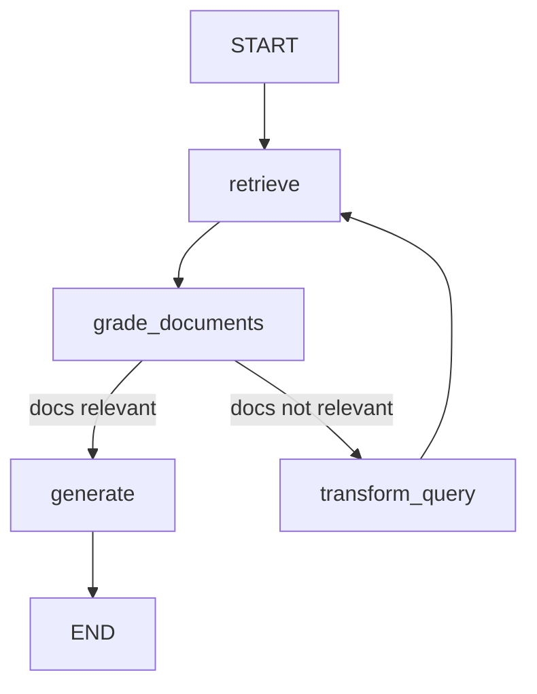

# LangGraph - Stateful Multi-Actor Workflows

## 1. What is LangGraph?

LangGraph is LangChain's framework for building **stateful, multi-step agent workflows** as graphs. Think of it as "state machines for AI agents."

```
LangChain LCEL:  Linear chains (A | B | C)
LangGraph:       Graphs with cycles, conditionals, state (A → B → C → A again?)
```

**Why LangGraph over plain agents?**
- Explicit control flow (not just "let the LLM decide everything")
- Persistent state across steps
- Human-in-the-loop at any point
- Cycles (agent can retry, loop, backtrack)
- Multi-agent coordination
- Streaming of intermediate states

## 2. Core Concepts

### State:
```python
from typing import TypedDict, Annotated
from langgraph.graph.message import add_messages

class AgentState(TypedDict):
    messages: Annotated[list, add_messages]  # Conversation history
    documents: list                           # Retrieved docs
    analysis: str                            # Intermediate result
    final_answer: str                        # Output
    iteration_count: int                     # Loop tracking
```

### Nodes (Actions):
```python
# Each node is a function that takes state and returns state updates
def retrieve(state: AgentState) -> dict:
    """Retrieve relevant documents"""
    query = state["messages"][-1].content
    docs = retriever.invoke(query)
    return {"documents": docs}

def generate(state: AgentState) -> dict:
    """Generate answer from docs"""
    context = "\n".join(d.page_content for d in state["documents"])
    response = llm.invoke(f"Context: {context}\nQuestion: {state['messages'][-1].content}")
    return {"final_answer": response.content}
```

### Edges (Transitions):
```python
# Conditional edge: decide which node to go to next
def should_retrieve(state: AgentState) -> str:
    """Decide whether to retrieve or answer directly"""
    last_message = state["messages"][-1].content
    if needs_retrieval(last_message):
        return "retrieve"
    else:
        return "generate"
```

## 3. Building a Graph

```python
from langgraph.graph import StateGraph, END, START

# Define the graph
workflow = StateGraph(AgentState)

# Add nodes
workflow.add_node("retrieve", retrieve)
workflow.add_node("grade_documents", grade_documents)
workflow.add_node("generate", generate)
workflow.add_node("transform_query", transform_query)

# Add edges
workflow.add_edge(START, "retrieve")
workflow.add_edge("retrieve", "grade_documents")

# Conditional edge
workflow.add_conditional_edges(
    "grade_documents",
    decide_to_generate,  # Function that returns next node name
    {
        "transform_query": "transform_query",  # Docs not relevant → rewrite query
        "generate": "generate"                  # Docs good → generate answer
    }
)

workflow.add_edge("transform_query", "retrieve")  # Cycle: retry retrieval
workflow.add_edge("generate", END)

# Compile
app = workflow.compile()

# Run
result = app.invoke({"messages": [HumanMessage("What was Q4 revenue?")]})
```

## 4. Visualization

```python
# See the graph structure
from IPython.display import Image
Image(app.get_graph().draw_mermaid_png())
```



## 5. Corrective RAG (Full Example)

A production-quality RAG system with self-correction:

```python
from typing import TypedDict, Annotated
from langgraph.graph import StateGraph, END, START
from langgraph.graph.message import add_messages
from langchain_openai import ChatOpenAI
from langchain_core.messages import HumanMessage

class RAGState(TypedDict):
    messages: Annotated[list, add_messages]
    documents: list
    generation: str
    query: str
    retries: int

def retrieve(state: RAGState) -> dict:
    """Retrieve documents for the query"""
    docs = retriever.invoke(state["query"])
    return {"documents": docs}

def grade_documents(state: RAGState) -> dict:
    """Filter out irrelevant documents"""
    grader = llm.with_structured_output(GradeOutput)
    relevant_docs = []
    for doc in state["documents"]:
        grade = grader.invoke(f"Is this relevant to '{state['query']}'?\n{doc.page_content}")
        if grade.relevant:
            relevant_docs.append(doc)
    return {"documents": relevant_docs}

def generate(state: RAGState) -> dict:
    """Generate answer from relevant documents"""
    context = "\n\n".join(d.page_content for d in state["documents"])
    response = llm.invoke(
        f"Context: {context}\nQuestion: {state['query']}\nAnswer:"
    )
    return {"generation": response.content}

def check_hallucination(state: RAGState) -> str:
    """Check if generation is grounded in documents"""
    checker = llm.with_structured_output(HallucinationCheck)
    result = checker.invoke(
        f"Docs: {state['documents']}\nAnswer: {state['generation']}\n"
        "Is the answer fully supported by the documents?"
    )
    if result.is_grounded:
        return "useful"
    elif state["retries"] < 3:
        return "retry"
    else:
        return "give_up"

def transform_query(state: RAGState) -> dict:
    """Rewrite query for better retrieval"""
    new_query = llm.invoke(
        f"Rewrite this query for better search results: {state['query']}"
    )
    return {"query": new_query.content, "retries": state["retries"] + 1}

# Build graph
workflow = StateGraph(RAGState)
workflow.add_node("retrieve", retrieve)
workflow.add_node("grade_documents", grade_documents)
workflow.add_node("generate", generate)
workflow.add_node("transform_query", transform_query)

workflow.add_edge(START, "retrieve")
workflow.add_edge("retrieve", "grade_documents")
workflow.add_conditional_edges(
    "grade_documents",
    lambda s: "generate" if s["documents"] else "transform_query",
    {"generate": "generate", "transform_query": "transform_query"}
)
workflow.add_conditional_edges(
    "generate",
    check_hallucination,
    {"useful": END, "retry": "transform_query", "give_up": END}
)
workflow.add_edge("transform_query", "retrieve")

app = workflow.compile()
```

## 6. Checkpointing (Persistence)

```python
from langgraph.checkpoint.memory import MemorySaver
from langgraph.checkpoint.sqlite import SqliteSaver

# In-memory (development)
memory = MemorySaver()
app = workflow.compile(checkpointer=memory)

# Persistent (production)
# with SqliteSaver.from_conn_string("checkpoints.db") as checkpointer:
#     app = workflow.compile(checkpointer=checkpointer)

# Every state transition is saved
config = {"configurable": {"thread_id": "conversation_1"}}
result = app.invoke({"messages": [HumanMessage("query")]}, config)

# Later: resume from last checkpoint
result = app.invoke({"messages": [HumanMessage("follow-up")]}, config)
```

## 7. Human-in-the-Loop

```python
# Interrupt at specific nodes for human review
app = workflow.compile(
    checkpointer=memory,
    interrupt_before=["execute_trade"]  # Pause before dangerous action
)

# Run until interruption
result = app.invoke(input, config)
# State is now paused before "execute_trade"

# Human reviews state
state = app.get_state(config)
print(state.values["proposed_trade"])  # See what agent wants to do

# Option 1: Approve and continue
app.invoke(None, config)  # Resume

# Option 2: Modify and continue
app.update_state(config, {"proposed_trade": modified_trade})
app.invoke(None, config)

# Option 3: Reject
# Simply don't invoke again, or route to different node
```

## 8. Streaming

```python
# Stream state updates as graph executes
async for event in app.astream_events(input, config, version="v2"):
    if event["event"] == "on_chain_stream":
        print(f"Node: {event['name']}, Output: {event['data']}")

# Stream specific node outputs
for output in app.stream(input, config, stream_mode="updates"):
    for node_name, state_update in output.items():
        print(f"{node_name}: {state_update}")
```

## 9. Multi-Agent Patterns with LangGraph

### Supervisor Pattern:
```python
# One agent delegates to specialists
class SupervisorState(TypedDict):
    messages: Annotated[list, add_messages]
    next_agent: str

def supervisor(state: SupervisorState) -> dict:
    """Decide which specialist to delegate to"""
    response = llm.with_structured_output(RouterOutput).invoke(
        f"Route this query to the right specialist: {state['messages'][-1].content}\n"
        "Options: researcher, analyst, trader"
    )
    return {"next_agent": response.choice}

def researcher(state): ...
def analyst(state): ...
def trader(state): ...

workflow = StateGraph(SupervisorState)
workflow.add_node("supervisor", supervisor)
workflow.add_node("researcher", researcher)
workflow.add_node("analyst", analyst)
workflow.add_node("trader", trader)

workflow.add_edge(START, "supervisor")
workflow.add_conditional_edges("supervisor", lambda s: s["next_agent"])
workflow.add_edge("researcher", "supervisor")  # Report back
workflow.add_edge("analyst", "supervisor")
workflow.add_edge("trader", END)  # Terminal action
```

### Collaboration Pattern:
```python
# Agents pass work to each other sequentially
# Research → Analysis → Recommendation → Review → Final
```

### Debate Pattern:
```python
# Two agents argue, third decides
# Bull case agent → Bear case agent → Judge → Decision
```

## 10. LangGraph vs Alternatives

| Feature | LangGraph | CrewAI | AutoGen |
|---------|-----------|--------|---------|
| State management | Explicit, typed | Implicit | Message-based |
| Control flow | Graph-based | Sequential/hierarchical | Conversation |
| Persistence | Built-in checkpointing | Manual | Manual |
| Human-in-loop | First-class | Limited | Possible |
| Streaming | Native | Limited | Limited |
| Debugging | Graph visualization | Logs | Logs |
| Production-ready | Yes | Growing | Research-oriented |

## 11. Production Deployment

```python
# LangGraph Cloud / LangGraph Platform
# Deploy as API with:
# - Persistent state
# - Streaming
# - Background runs
# - Cron jobs
# - Webhooks

# langgraph.json
{
    "graphs": {
        "financial_agent": "./agent.py:app"
    },
    "dependencies": ["langchain-openai", "langgraph"]
}
```

## 12. Interview Talking Points

- "LangGraph gives you the control of traditional programming with the flexibility of AI agents"
- "It's like a state machine where transitions can be AI-decided"
- "The key advantage over plain agents: you can guarantee certain steps happen, add human checkpoints, and handle failures gracefully"
- "For financial applications: you NEED the human-in-the-loop and explicit state — you can't just let an agent run wild"
- "Checkpointing means you can resume long-running analyses across sessions"
- "I'd use LangGraph for any workflow more complex than 'ask LLM, get answer'"
